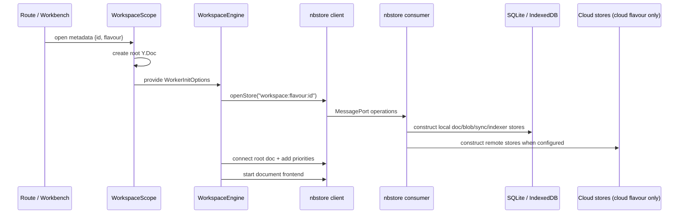

# Persistence and Data Flow

## Bottom line

The current application is local-first but database-backed. Documents are BlockSuite stores over Yjs; nbstore persists Yjs updates, blobs, sync state, and indexes in SQLite on Electron/native platforms and IndexedDB on web. Cloud workspaces add remote document/blob/awareness/indexer stores while retaining local storage.

No source evidence establishes ordinary user-visible files as the current source of truth. Import/export converts between files and the internal model, but it is not a continuously synchronized file authority.

## Workspace open and engine start



Evidence:

- Workspace/root Y.Doc and lazy `WorkspaceImpl`: `packages/frontend/core/src/modules/workspace/entities/workspace.ts:21-73`.
- Worker-backed store open and root-doc priority: `packages/frontend/core/src/modules/workspace/entities/engine.ts:55-89`.
- Desktop storage composition: `packages/frontend/apps/electron-renderer/src/background-worker/index.ts:20-47`.
- Web storage composition: `packages/frontend/apps/web/src/nbstore.worker.ts:13-31`.
- Consumer/client operation boundary: `packages/common/nbstore/src/worker/consumer.ts:70-125,337-370`; `packages/common/nbstore/src/worker/client.ts:76-101,226-246`.

## Data model

### Workspace

`Workspace` owns a root `Y.Doc` identified by the workspace ID. `WorkspaceImpl` wraps that doc, creates BlockSuite workspace metadata, maintains the document collection, and creates a `BlobEngine` (`packages/frontend/core/src/modules/workspace/entities/workspace.ts:21-73`, `packages/frontend/core/src/modules/workspace/impls/workspace.ts:36-110`).

### Document

Each `DocImpl` owns:

- a Yjs space document;
- a `blocks` Y.Map;
- an awareness store;
- a BlockSuite `StoreContainer`;
- schema/store extensions obtained from the application store manager.

Evidence: `packages/frontend/core/src/modules/workspace/impls/doc.ts:21-109,133-178`.

`DocsStore.create` writes document metadata (ID, title, create/update dates, tags) into the workspace state and `DocsService.create` initializes the BlockSuite document and emits lifecycle events (`packages/frontend/core/src/modules/doc/stores/docs.ts:25-64`, `packages/frontend/core/src/modules/doc/services/docs.ts:144-178`).

### Schema

The application registers all AFFiNE BlockSuite schemas plus AI chat and transcription schemas (`packages/frontend/core/src/modules/workspace/global-schema.ts:1-18`). This is a mixed seam; the general document schema currently has direct AI dependencies.

## Local persistence selection

`LocalWorkspaceFlavourProvider` selects storage by platform (`packages/frontend/core/src/modules/workspace-engine/impls/local.ts:190-222`):

| Concern | Electron / iOS / Android | Web / mobile web |
|---|---|---|
| Documents | `SqliteDocStorage` | `IndexedDBDocStorage` |
| Blobs | `SqliteBlobStorage` | `IndexedDBBlobStorage` |
| Document sync state | `SqliteDocSyncStorage` | `IndexedDBDocSyncStorage` |
| Blob sync state | `SqliteBlobSyncStorage` | `IndexedDBBlobSyncStorage` |
| Search index | `SqliteIndexerStorage` | `IndexedDBIndexerStorage` |
| Index sync state | SQLite on Electron; IndexedDB otherwise | `IndexedDBIndexerSyncStorage` |
| Legacy v1 | SQLite v1 helper on Electron | IndexedDB v1 |

Storage constructor registries are explicit at `packages/common/nbstore/src/impls/sqlite/index.ts:17-24` and `packages/common/nbstore/src/impls/idb/index.ts:16-28`.

Local workspace IDs are stored in Electron shared global state, with localStorage migration and a BroadcastChannel for tab updates (`packages/frontend/core/src/modules/workspace-engine/impls/local.ts:55-188,321-354`). Electron can additionally scan workspace databases through the helper process (`packages/frontend/core/src/modules/workspace-engine/impls/local.ts:149-175`).

## Create flow

For a local workspace:

1. Generate a workspace ID.
2. Open local document and blob storage.
3. Create a root Y.Doc and `WorkspaceImpl`.
4. Run the caller-provided initializer.
5. Encode and push root/subdocument Yjs state.
6. Save the workspace ID and broadcast the list change.

Evidence: `packages/frontend/core/src/modules/workspace-engine/impls/local.ts:237-319`.

For an opened workspace, the root document and each document/awareness instance are connected to the worker frontends (`packages/frontend/core/src/modules/workspace/entities/workspace.ts:39-70`). The engine adds root-doc and indexer priorities before starting synchronization (`packages/frontend/core/src/modules/workspace/entities/engine.ts:78-88`).

## Update flow

BlockSuite edits mutate the Yjs document. The connected nbstore document frontend serializes/synchronizes updates through the worker. `Doc` listens to Yjs transactions to update document timestamps (`packages/frontend/core/src/modules/doc/entities/doc.ts:19-45`). Search indexing runs against the same connected document stream.

The exact byte-level SQLite schema and batching policy are delegated to `packages/common/nbstore/src/impls/sqlite/**` and native crates under `packages/frontend/native/nbstore/**`; this map confirms the boundary but does not claim every table/statement was enumerated.

Confidence: **STRONG**.

## Blob and attachment flow

```mermaid
flowchart LR
  File["File / imported asset"] --> BE["BlockSuite BlobEngine"]
  BE --> BF["Workspace engine blob frontend"]
  BF --> Local["SQLite or IndexedDB blob storage"]
  BF --> Remote["CloudBlobStorage (cloud flavour)"]
  Block["Attachment/image block"] -->|sourceId| BE
  Viewer["Attachment/PDF/media viewer"] -->|get(sourceId)| BE
```

`Workspace` adapts nbstore blob records to `Blob` objects and writes new blobs to the engine (`packages/frontend/core/src/modules/workspace/entities/workspace.ts:39-64`). Attachment helpers resolve a block's `sourceId`, read from `blobSync`, and upload replacement files (`blocksuite/affine/blocks/attachment/src/utils.ts:24-132`). Import commits blobs before materializing document snapshots (`packages/frontend/core/src/desktop/dialogs/import/commit-service.ts:54-84`).

Unused-blob management lists, previews, and deletes through the workspace flavour provider (`packages/frontend/core/src/modules/blob-management/entity/unused-blobs.ts:33-136`).

## Search and index flow

`DocsSearchService` uses the workspace engine's indexer:

- title search uses a `doc` match query;
- full-text search aggregates `block` content by `docId`;
- hits include block IDs, flavours, highlights, and scores;
- callers can prefer local or remote index results;
- reference queries decode indexed reference payloads.

Evidence: `packages/frontend/core/src/modules/docs-search/services/docs-search.ts:77-260`.

Desktop index storage is SQLite; web index storage is IndexedDB. Cloud workspaces may add `CloudIndexerStorage` when the server advertises the indexer feature (`packages/frontend/core/src/modules/workspace-engine/impls/cloud.ts:456-558`).

## Cloud workspace flow

Cloud workspaces still select local SQLite/IndexedDB storage for cached docs, blobs, sync state, and indexes (`packages/frontend/core/src/modules/workspace-engine/impls/cloud.ts:112-144`). Their worker options add:

- `CloudDocStorage`;
- `CloudBlobStorage`;
- `CloudAwarenessStorage`;
- conditional `CloudIndexerStorage`;
- legacy v1 remote compatibility.

Evidence: `packages/frontend/core/src/modules/workspace-engine/impls/cloud.ts:456-558`.

Cloud HTTP/GraphQL uses the configured server base URL (`packages/common/nbstore/src/impls/cloud/http.ts:6-95`). Socket.IO carries space join/leave, Yjs updates, awareness, realtime requests/subscriptions, and telemetry (`packages/common/nbstore/src/impls/cloud/socket.ts:16-319`).

Classification: **EXCLUDE LATER**, preserving it only as migration and removal evidence.

## Global and session state

The common graph registers:

- global state and cache services;
- nbstore service;
- LocalStorage global state/cache;
- IndexedDB cache storage;
- sessionStorage session state.

Evidence: `packages/frontend/core/src/modules/storage/index.ts:37-52`.

Electron overrides these with shared-storage-backed implementations during desktop module setup (`packages/frontend/apps/electron-renderer/src/app/effects/modules.ts:39-50`; IPC details in `IPC_AND_PRELOAD_MAP.jsonl`).

Auth tokens are a separate persistence path: encrypted `auth-sessions.json` under Electron user data when safeStorage is available, otherwise memory-only, plus an installation ID file (`packages/frontend/apps/electron/src/main/auth/auth-session.ts:16-105,175-199`). Classification: **EXCLUDE LATER**.

## Import and export are conversion, not authority

Import adapters convert Markdown, HTML, ZIP ecosystems, DOCX/OneNote, snapshots, and workspace files into BlockSuite snapshots/Yjs state (`packages/frontend/core/src/desktop/dialogs/import/index.tsx:286-431`; `packages/frontend/core/src/desktop/dialogs/import/commit-service.ts:47-142`).

Export adapters convert a loaded BlockSuite store to HTML, Markdown, snapshot ZIP, PDF, or PNG (`packages/frontend/core/src/components/hooks/affine/use-export-page.ts:90-205`). These are one-shot operations. There is no confirmed watcher that reconciles external file edits back into Yjs, and no writer that atomically updates ordinary workspace files after every document mutation.

## Hardened target gap

Required but not implemented in the mapped source:

1. File/directory discovery and ignore policy.
2. Stable mapping from a file path to document identity.
3. Parsers and serializers for the chosen ordinary file formats.
4. File change watcher with self-write suppression.
5. Atomic writes and crash recovery.
6. Conflict policy between editor state and external edits.
7. Derived SQLite index rebuild from files.
8. Attachment path/content-address policy.
9. Migration from current Yjs/SQLite/IndexedDB workspaces.
10. Tests proving files are authoritative and the index is disposable.

The current Yjs + storage engine should therefore be treated as a mature editor/storage substrate and migration source, not silently described as the final MindRoom persistence model.
